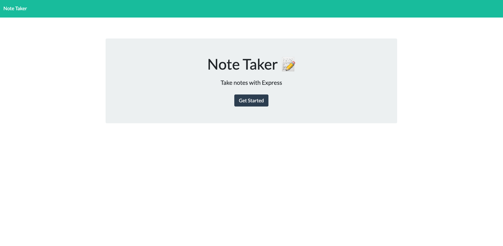

# Note Taker

 
 

## **Description**
* This is a simple note taking application
 
 

## **Table of Contents**
- [Installation](#Installation)  
- [Usage](#Usage)  
- [License](#License)  
- [Contributing](#Contributing)  
- [Tests](#Tests)  
- [Questions](#Questions)  
 
 

## **Installation**
* Start the app on Heroku
 
 

## **Usage**
* This is to provide easy note taking to users
 
 

## **License**
### *MIT*  
        A short and simple permissive license with conditions only requiring preservation of copyright and license notices. Licensed works, modifications, and larger works may be distributed under different terms and without source code.
 

## **Contributing**
* No contributions at this time
 
 

## **Tests**
    
* npm run dev 
 
 

## **Questions**
* GitHub: https://github.com/KevinHenleyCode

* For more questions you can reach me at my Email:(kevinhenleyinfo@gmail.com)
 
 

## **ScreenShot**

 
 

## **Links**
* [Site](https://infinite-woodland-08374.herokuapp.com/)
* [Heroku](https://dashboard.heroku.com/apps/infinite-woodland-08374)
* [GitHub](https://github.com/KevinHenleyCode/homework_week_11)

